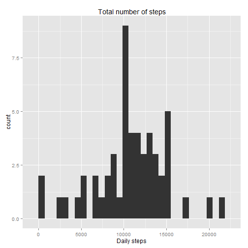
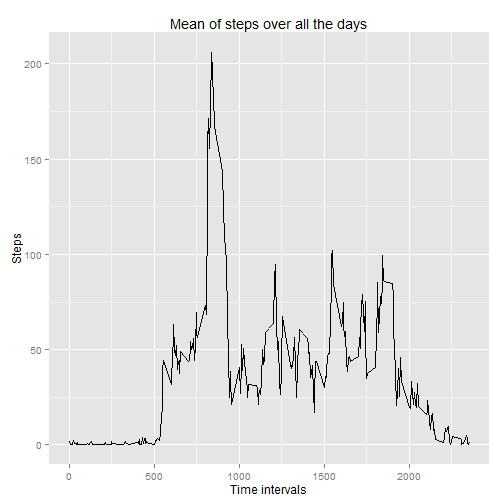
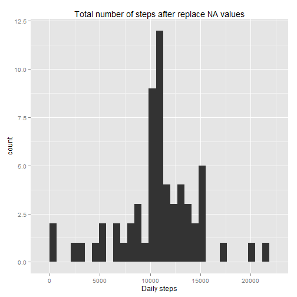
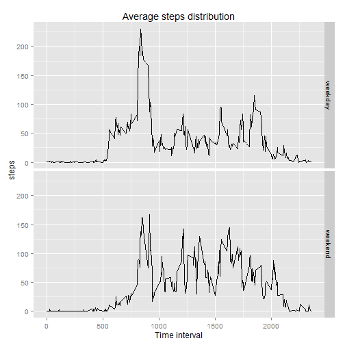

## Loading and preprocessing the data


```r
# Load libraries
library(ggplot2)
# Read data file
if(!file.exists("repdata-data-activity.zip") & !file.exists("activity.csv")) download.file("https://d396qusza40orc.cloudfront.net/repdata%2Fdata%2Factivity.zip", "repdata-data-activity.zip")
if(!file.exists("activity.csv")) unzip("repdata-data-activity.zip")
stepdata<-read.csv("activity.csv", header=TRUE)
stepdata[,2]<-as.Date(stepdata[,2], format="%Y-%m-%d")
stepdata[,3]<-as.factor(stepdata[,3])
```

## What is mean total number of steps taken per day?

Create the histogram of the total number of steps taken per day.


```r
# Make histogram of daily steps
dailysteps<-tapply(stepdata$steps, stepdata$date, sum)
qplot(dailysteps, geom="histogram", main="Total number of steps", xlab="Daily steps")
```

```
## stat_bin: binwidth defaulted to range/30. Use 'binwidth = x' to adjust this.
```

 

And calculate daily mean and median of the total number of steps taken per day.


```r
# Compute mean and median
dailymean<-mean(dailysteps, na.rm=TRUE)
dailymedian<-median(dailysteps, na.rm=TRUE)
```

So the median is 10765 and the mean is 1.0766189 &times; 10<sup>4</sup>.


## What is the average daily activity pattern?

Compute 5 minute interval mean over all the days:


```r
# 5 minute intervalls mean over all the days
minutesteps<-tapply(stepdata$steps, stepdata$interval, mean, na.rm=TRUE)
qplot(as.integer(names(minutesteps)), minutesteps, geom="line", main="Mean of steps over all the days", xlab="Time intervals", ylab="Steps")
```

 


```r
maxinterval<-names(minutesteps[minutesteps==max(minutesteps)])
```

And the maximum is in the 835 interval.

## Imputing missing values

Locate NA values, and replace it with 5 minutes interval mean in that specified interval.


```r
nanumber<-sum(is.na(stepdata$steps))
```

The orignal dataset has 2304 NA values. Start replacing with mean values:


```r
stepdata_nona<-stepdata
stepdata_nona[is.na(stepdata$steps), "steps"]<-as.integer(minutesteps[stepdata[is.na(stepdata$steps), "interval"]])
```

Create a corrected histogram, mean and median:


```r
qplot(tapply(stepdata_nona$steps, stepdata_nona$date, sum), geom="histogram", main="Total number of steps after replace NA values", xlab="Daily steps")
```

```
## stat_bin: binwidth defaulted to range/30. Use 'binwidth = x' to adjust this.
```

 

```r
correctedmean<-mean(tapply(stepdata_nona$steps, stepdata_nona$date, sum))
correctedmedian<-median(tapply(stepdata_nona$steps, stepdata_nona$date, sum))
```

The corrected median is 10641 and the corrected mean is 1.074977 &times; 10<sup>4</sup>.
There is some difference between the corrected and the original values, but if we don't using rounding, there is only a small difference.


```r
stepdata_nona_nointeger<-stepdata
stepdata_nona_nointeger[is.na(stepdata$steps), "steps"]<-minutesteps[stepdata[is.na(stepdata$steps), "interval"]]
correctedmean_nointeger<-mean(tapply(stepdata_nona_nointeger$steps, stepdata_nona_nointeger$date, sum))
correctedmedian_nointeger<-median(tapply(stepdata_nona_nointeger$steps, stepdata_nona_nointeger$date, sum))
```

The corrected mean with no rounded substitution is 1.0766189 &times; 10<sup>4</sup> and the median is 1.0766189 &times; 10<sup>4</sup>.

The total number of steps is changed significantly, because we put some data into the dataset, this has shown on the above histogram.

## Are there differences in activity patterns between weekdays and weekends?

For the weekday statistic I choosed to use the format() function instead of weekdays(), because weekdays() output depends on locale settings.


```r
weekday<-c("weekday", "weekday", "weekday", "weekday", "weekday", "weekend", "weekend")
stepdata_nona[,"dayclass"]<-weekday[as.numeric(format(stepdata_nona$date, "%u"))]
stepdata_nona$dayclass<-as.factor(stepdata_nona$dayclass)

steps_by_weekdays<-aggregate(steps ~ interval+dayclass, stepdata_nona, mean)
qplot(as.integer(as.character(interval)), steps, data=steps_by_weekdays, geom="line", facets=dayclass~., main="Average steps distribution", xlab="Time interval")
```

 

As shown, there are some differences between weekday and weekend step distribution.
